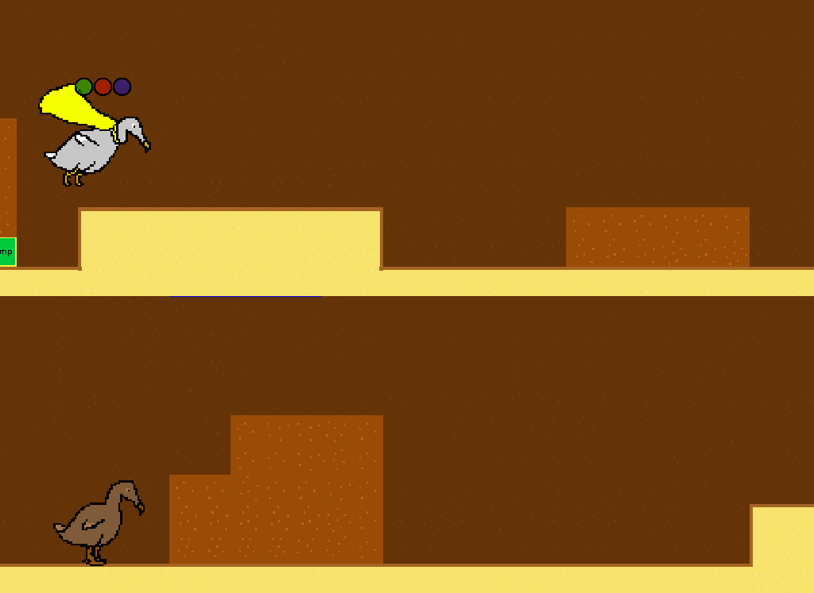

=========
Dodos Day
=========

Dodo(om)s Day is about prolonging the inevitable...

Run
---

To run the project on Linux, you will need to install:

- SFML (version 2.3.2 or higher, https://www.sfml-dev.org/)
- Box2D (version 2.3.1 or higher, https://http://box2d.org/>)
- Lua (version 5.1 or higher)
- GCC or Clang (with C++14 support)
- CMake (version 3.5 or higher)

Then ``git clone`` the project, get the submodules and apply the tmxlite
patch:

.. code-block:: shell

	git clone https://github.com/qtux/ggj18.git
	cd ggj18
	git submodule update --init
	git apply patch_tmxlite.diff

Now you can compile and run the project:

.. code-block:: shell

	make
	./build/run

Links
-----

https://globalgamejam.org/2018/games/dodos-day

License
-------

This project is licensed under The zlib/libpng License (Zlib).
